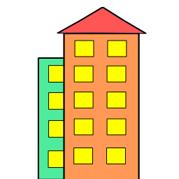

# startopper

	

	

This will be a online startup emulator, written in a new and common environment 
for these startups: Node.js

(No offenses, only an observation. I :heart: you guys :D)

## Things to do

* [ ] Finish the backend

* [ ] A nice frontend

## Licenses

Copyright (C) 2017 Arthur M.

All data in this repository is licensed under the MIT license.
